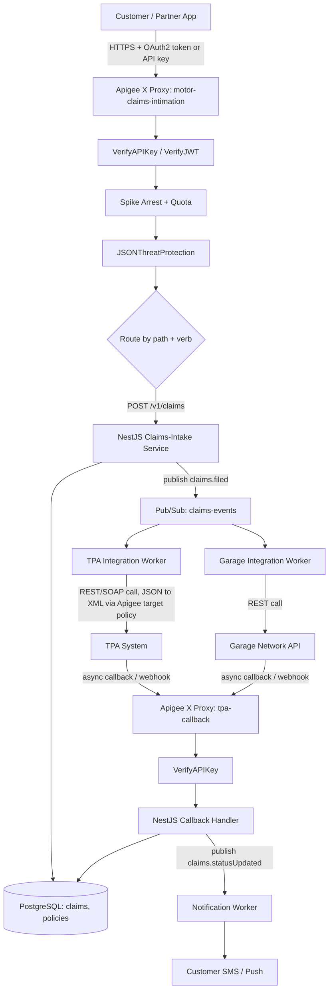

# EY → HDFC Ergo — Backend (Node.js/NestJS) + Apigee Developer
### Interview Prep & Study File · Pune · 5 Days WFO · "For HE Only"

> **Vendor / hiring org:** EY (recruiter: Karen) · **Payroll / end client:** HDFC Ergo General Insurance ("HE") · **Location:** Pune, 5 days work-from-office
> **Req:** Junior Backend (Node.js & NestJS) + APIGEE Developer — 2 to 4 Years (For HE Only)
> **My profile fit:** Node.js/TypeScript/Express, AWS serverless, REST API design, JWT/OAuth, VAPT-hardened APIs — strong. NestJS syntax, Apigee, PostgreSQL, GCP — real gaps, all bridgeable from my AWS/Node mental model. General-insurance domain — new, closable via Vkonnect (healthcare adjacency) + EY Risk.ai.
> **Priority weak areas (prep order):** Apigee (biggest gap — deepest section below) → NestJS specifics → PostgreSQL → insurance domain → GCP → DevOps tooling (Terraform/K8s/Helm/Prometheus-Grafana-ELK).
> **Band note:** JD is scoped 2–4 yrs; I'm ~6 yrs. Section 13 has the honest script for that conversation.

---

## 0. How to use this file

- **Section 3 (Apigee) is the make-or-break section.** It's my single biggest gap and the one thing this JD is named after. Read it twice, drill the AWS↔Apigee table until the mappings are automatic, and rehearse the Q&A out loud.
- **Sections 4–7** (NestJS, PostgreSQL, Security, GCP) are "convert strong adjacent knowledge into fluent vocabulary" — I already do the *thing*, I just need the new syntax/nouns.
- **Section 8** (insurance domain) is 30 minutes of reading for a disproportionate amount of interview credibility — insurers can tell instantly who has and hasn't bothered to learn the domain.
- **Section 12** (system design) is the likely centerpiece of an L2/architecture round — it's the one scenario that forces me to use Apigee + NestJS + PostgreSQL + async integration together, so rehearse it whiteboard-style, out loud.
- **Section 13** has the actual words to say about payroll, WFO, and the 2–4 yr band mismatch — don't improvise that live.

---

## 1. Role Snapshot

### 1.1 What "EY → HDFC Ergo, For HE Only" actually means

This is **not** a normal EY consulting engagement (where you stay on EY's payroll and rotate across clients). "For HE Only" in the req title is the tell: EY is running the **sourcing and screening pipeline** — same as a staffing vendor — but the successful candidate goes onto **HDFC Ergo's own payroll**, works exclusively for HDFC Ergo, and is managed day-to-day by HDFC Ergo, not EY. Karen's email confirms this: she's asking payroll/location/WFO/CTC questions a recruiter asks *before* a client interview, not an EY-project-staffing conversation.

**Mental model:** treat this like a **direct HDFC Ergo hire sourced through EY's recruitment arm**, not like joining EY-the-consultancy. The offer letter, appraisal cycle, and comp review will be HE's. EY's role effectively ends at placement (possibly with some onboarding-logistics involvement).

**Why this matters for how I present myself:** I don't need to sell "why EY" — I need to sell "why HDFC Ergo" and "why this specific technical stack." And I *can* use my EY history (Risk.ai) as a credibility signal about EY's engineering bar, since Karen/EY is the one running this pipeline (Section 13.2).

### 1.2 What HDFC Ergo does

HDFC ERGO General Insurance is a joint venture between **HDFC Bank (50.33%)** and **ERGO International AG**, part of the **Munich Re Group** (49.46%) — the shareholding shifted to HDFC Bank directly after HDFC Ltd. merged into HDFC Bank in 2023. Founded 2002, it's one of India's largest **private general (non-life) insurers**.

| Segment | Products |
|---|---|
| Retail | Motor, health, travel, home, personal accident |
| Corporate | Property, marine, liability |
| Rural | Rainfall-index insurance, cattle insurance |

"General insurance" = everything that **isn't** life insurance — i.e., short-tenure (usually annual), indemnity-based policies where the payout is "make the customer whole after a loss," not a lump-sum death/maturity benefit. That distinction matters because it shapes the whole API surface: motor and health claims are **high-frequency, high-volume, time-sensitive** (a customer in a hospital or at an accident site needs fast API-driven decisions), unlike life insurance's low-frequency, high-value claims.

### 1.3 Why an insurer needs Apigee specifically

Insurers run **decades-old core/policy-admin systems** (often mainframe or monolith, sometimes SOAP/XML) that can't be touched often or safely. At the same time they need to expose that data to a growing number of external parties: **TPAs, hospitals, garages, brokers, aggregators (PolicyBazaar-style), and now IRDAI's own national infrastructure.** Apigee sits in front of the core system as a **facade + control plane**:

- **Security** the core system doesn't have (OAuth2/JWT/API keys, threat protection) without touching legacy code.
- **Traffic protection** (Spike Arrest, Quota) so an aggressive partner integration can't take down the core.
- **Protocol translation** (JSON↔XML) so modern JSON-speaking clients can talk to a SOAP/XML mainframe.
- **Per-partner visibility** (Analytics, API Products) — critical when dozens of TPAs/garages/brokers each need different rate limits and usage reporting.
- **A stable public contract** that can evolve (versioning) even while the legacy backend behind it doesn't.

**The concrete, current reason this role probably exists right now:** IRDAI's **Bima Sugam** — India's national insurance marketplace (Digital Public Infrastructure) — went live in **Phase 1 in December 2025**, and insurers are expected to have **motor, health, and term insurance APIs integrated by end-September 2026**. That's a hard external deadline forcing every general insurer, HDFC Ergo included, to expose standardized, secured, rate-limited APIs fast. Say this in the interview — it signals you understand *why* they're hiring, not just *what* the JD says.

### 1.4 How to talk about the payroll setup confidently

Don't hedge on this. Karen's email leads with it because it's a common candidate drop-off point. My script:

> "Yes, I'm comfortable with HDFC Ergo payroll, Pune, and five days in office. I'd actually frame it as a positive — I'm looking for direct ownership on one product/domain rather than rotating across clients, and general insurance is a domain I want depth in, not another domain-agnostic engagement."

---

## 2. JD-to-Profile Mapping Table

**Legend:** Strong = direct, provable evidence · Partial = adjacent skill, real but not identical · Gap = genuinely new, needs study (this file).

| JD Requirement | Level | One-line story / bridge |
|---|---|---|
| Node.js backend development | **Strong** | "Node/TypeScript/Express has been my primary backend for ~6 years across UTEC, Vkonnect, EY Risk.ai." |
| NestJS specifically | **Partial** | "My architecture instincts — layered services, DI-style composition, centralized error handling — are already NestJS's shape; I need the decorator/DI vocabulary, which is Section 4 of my own prep." |
| Apigee (Edge / Apigee X) | **Gap** | "I've run AWS API Gateway in front of Lambda at 6M-user scale with the same concerns — throttling, auth, versioning. Apigee is the same job, GCP-native, XML-configured policies instead of console/CFN — I map every concept 1:1 (Section 3)." |
| Insurance lifecycle APIs (quote/issuance/endorsement/renewal/claims/cancellation) | **Gap → learnable fast** | "New domain, but I've built comparable stateful lifecycle systems (UTEC's order/dealer lifecycle) and I've done the reading (Section 8)." |
| TPA / garage / hospital / partner integrations | **Partial** | "P&G's BigCommerce→Shopify GraphQL migration and Vkonnect's provider integrations are the same shape: external systems, inconsistent contracts, async callbacks, retry/idempotency discipline." |
| Compliance-ready APIs for insurance regulation | **Partial** | "UTEC went through full VAPT hardening under audit pressure — that's the same discipline as compliance-driven API design: audit trails, least privilege, explainability." |
| REST APIs over PostgreSQL | **Partial** | "REST API design is strong; PostgreSQL specifically is the gap — my depth is DynamoDB. Section 5 bridges it; relational modeling isn't new to me, DynamoDB forces even sharper access-pattern thinking." |
| OAuth 2.0 / JWT / API Keys | **Strong** | "JWT middleware, OAuth2 client-credentials flows, and API-key-gated endpoints are things I've shipped, just not through Apigee's policy layer specifically." |
| Traffic management (Spike Arrest, Quota, rate limiting) | **Strong concept, gap on syntax** | "This is API Gateway throttling/usage plans under a different name — Section 3.3." |
| JSON ↔ XML transforms | **Gap** | "Not something modern Node stacks need often, but it's a declarative policy in Apigee, not something I need to hand-write — Section 3.3." |
| Apigee Analytics | **Gap** | "Direct equivalent of CloudWatch API Gateway metrics + my OpenSearch dashboard experience — same instincts, new tool." |
| Deploy/manage on GCP | **Gap** | "AWS-deep, GCP-new. The IAM/VPC/networking *concepts* transfer almost completely — Section 7." |
| CI/CD support | **Strong** | "GitHub Actions pipelines, build→test→deploy, on real production services." |
| Prod troubleshooting for integrations | **Strong** | "This is my daily reality on UTEC and Vkonnect — Section 10 has the STAR story." |
| OpenAPI/Swagger docs | **Strong** | "Standard practice on every API I've shipped." |
| Unit testing/debugging | **Strong** | "Jest suites across all four projects." |
| GCP IAM, KMS, Secret Manager | **Gap → Partial** | "Direct AWS analogues (IAM, KMS, Secrets Manager) I use daily — Section 7 table." |
| CI/CD: Jenkins, GitLab CI | **Partial** | "GitHub Actions depth; Jenkins/GitLab CI are the same DAG-of-stages model with different YAML — Section 9." |
| IaC: Terraform, CloudFormation | **Partial** | "CloudFormation (incl. nested stacks) is a real strength; Terraform's state+plan+apply model is new but the declarative-IaC discipline isn't — Section 9." |
| Docker, Kubernetes, Helm | **Partial** | "Docker is solid; K8s/Helm are gap areas since my production experience leans serverless (Lambda) — Section 9." |
| Prometheus, Grafana, ELK | **Gap → Partial** | "ELK is functionally the same stack as OpenSearch + OpenSearch Dashboards, which I run in production on UTEC — that's a near-direct transfer, not a cold start." |
| Bash, Python | **Partial** | "Bash comfortably for ops/scripting; Python is casual, not production-depth." |
| Git/GitHub/GitLab | **Strong** | "Daily tool for 6 years." |
| Linux (Ubuntu/CentOS) | **Strong** | "EC2/container ops experience across projects." |
| Networking: VPC/Subnets/SGs/LBs | **Strong (AWS) → Partial (GCP specifics)** | "VPC design, security groups, ALB/NLB routing on AWS — GCP's model is different enough to name explicitly (Section 7)." |
| Nexus / Artifactory | **Gap → Partial** | "Conceptually identical to npm registry / private package feeds I've configured; specific tool is new." |
| General insurance domain | **Gap → bridged** | "Healthcare (Vkonnect) is the closest adjacent regulated, PHI-sensitive, provider-integration-heavy domain I've worked in — Section 8 makes the bridge explicit." |

**Honest read:** ~55–60% of this JD is a strong or near-strong match at senior depth (Node fundamentals, REST/API design, security, CI/CD, prod support). The concentrated risk is a **10–15 minute Apigee-syntax + PostgreSQL screen**. Everything below is weighted accordingly.

---

## 3. Apigee Crash Course [DEEPEST SECTION — biggest gap]

> Read this as: *"I already know API Gateway. Apigee is API Gateway's GCP-native, more policy-driven cousin — here's the vocabulary swap."* Every concept below is anchored to something I've already shipped on AWS API Gateway.

### 3.1 Apigee Edge vs Apigee X (and why the JD lists both)

| | Apigee Edge (Public Cloud) | Apigee Edge (Private Cloud / OPDK) | Apigee X |
|---|---|---|---|
| What it is | Google's original SaaS API management platform | Self-hosted/on-prem version of Edge | Current-generation, **GCP-native** platform |
| Infra | Google-managed, multi-tenant | Customer-hosted | Runs on **GKE** inside the customer's own GCP project |
| Identity/networking | Apigee-specific | Apigee-specific | Integrates natively with **Cloud IAM, Cloud KMS, VPC-SC, Private Service Connect** |
| Status (2026) | **Classic UI retired Nov 2025**; being wound down | Final version EOL **Feb 2027** | Actively developed — Google's push target |
| Analytics | Apigee's own analytics store | Same | Native **BigQuery** export for custom analytics |

**Why this matters for HDFC Ergo specifically:** the JD explicitly says "Apigee Edge / Apigee X," which strongly suggests HDFC Ergo has **legacy Edge proxies mid-migration to Apigee X** — exactly the situation most enterprises are in right now, since Google has been pushing everyone off Edge. This is a great question to ask in the interview (Section 13.4) — it signals you know the product's current lifecycle state, not just the feature list.

**One-sentence answer if asked "Edge vs X?":** *"Edge was Apigee's original SaaS platform; Apigee X is the current GCP-native generation — same policy model and proxy concepts, but it runs on GKE inside your own GCP project and plugs into Cloud IAM/KMS/VPC-SC natively instead of being a separate walled garden. Google's sunsetting Edge, so most enterprises I'd expect to meet are mid-migration, which is probably exactly HDFC Ergo's situation given the JD lists both."*

### 3.2 Proxy anatomy — ProxyEndpoint vs TargetEndpoint

An **API Proxy** is the whole gateway artifact Apigee runs — the equivalent of an entire API Gateway API definition. It has two halves:

| Apigee | Faces | AWS API Gateway equivalent | Express equivalent |
|---|---|---|---|
| **ProxyEndpoint** | The client | Method + Integration Request (the client-facing contract) | Your middleware chain, before the route handler runs |
| **TargetEndpoint** | The backend | Integration Response / backend integration config | The outbound `axios`/`fetch` call your handler makes, plus response post-processing |

**Request flow through a proxy** (this is the diagram to be able to draw from memory):

```
Client
  │
  ▼
ProxyEndpoint PreFlow  (runs on every request, regardless of path/verb)
  │
  ▼
ProxyEndpoint Conditional Flow  (matched by resource path + HTTP verb — e.g. "POST /claims")
  │
  ▼
ProxyEndpoint PostFlow
  │
  ▼  (Apigee routes to a TargetEndpoint via a RouteRule)
TargetEndpoint PreFlow
  │
  ▼
TargetEndpoint Conditional Flow
  │
  ▼
TargetEndpoint PostFlow
  │
  ▼
Backend service (your NestJS API / core insurance system)
  │
  ▼  (response flows back UP through the same flows, in reverse, on the "Response" side of PreFlow/PostFlow)
Client
```

Every Flow (PreFlow/Conditional/PostFlow, on both endpoints) has a **Request** phase and a **Response** phase — that's where you attach policies (e.g., VerifyAPIKey in ProxyEndpoint PreFlow-Request; ResponseCache population in TargetEndpoint PostFlow-Response).

**Minimal proxy XML skeleton** (proxies are configured as XML bundles, not code):

```xml
<!-- ProxyEndpoint: default.xml -->
<ProxyEndpoint name="default">
  <HTTPProxyConnection>
    <BasePath>/v1/motor-claims</BasePath>
  </HTTPProxyConnection>
  <PreFlow name="PreFlow">
    <Request>
      <Step><Name>VerifyAPIKey</Name></Step>
      <Step><Name>Spike-Arrest-1</Name></Step>
    </Request>
  </PreFlow>
  <Flows>
    <Flow name="CreateClaim">
      <Condition>(proxy.pathsuffix MatchesPath "/claims") and (request.verb = "POST")</Condition>
      <Request>
        <Step><Name>Quota-Per-Partner</Name></Step>
      </Request>
    </Flow>
  </Flows>
  <RouteRule name="default">
    <TargetEndpoint>claims-service</TargetEndpoint>
  </RouteRule>
</ProxyEndpoint>
```

```xml
<!-- TargetEndpoint: claims-service.xml -->
<TargetEndpoint name="claims-service">
  <PreFlow name="PreFlow">
    <Request>
      <Step><Name>AssignMessage-AddAuthHeader</Name></Step>
    </Request>
  </PreFlow>
  <HTTPTargetConnection>
    <URL>https://nestjs-claims-api.internal.hdfcergo.com</URL>
  </HTTPTargetConnection>
</TargetEndpoint>
```

**Say this out loud version:** *"ProxyEndpoint is the client contract — like my API Gateway resource + method definitions. TargetEndpoint is the backend call — like the integration/backend config behind it. Both have PreFlow/Flow/PostFlow on request and response, and I attach policies as named Steps at whichever point makes sense — auth as early as possible, response shaping as late as possible."*

### 3.3 Key Policies — with AWS equivalents and snippets

#### Spike Arrest — burst/short-window smoothing

Prevents sudden traffic spikes (seconds-level bursts) from overwhelming the backend. It is **not** a usage cap — it's a rate *smoother*, like a token-bucket throttle.

```xml
<SpikeArrest name="Spike-Arrest-1">
  <Rate>30ps</Rate>  <!-- 30 requests per second -->
</SpikeArrest>
```

**AWS equivalent:** API Gateway's steady-state + burst throttle settings (account/stage/method-level token bucket), or a WAF rate-based rule for burst protection.

#### Quota — business-level usage cap

A longer-window (day/week/month), per-app or per-API-product usage ceiling — this is the commercial/tiering layer, not the DoS-protection layer.

```xml
<Quota name="Quota-Per-Partner">
  <Interval>1</Interval>
  <TimeUnit>day</TimeUnit>
  <Allow count="10000" countRef="verifyapikey.VerifyAPIKey.apiproduct.developer.quota.limit"/>
  <Identifier ref="request.header.apikey"/>
</Quota>
```

**AWS equivalent:** API Gateway **Usage Plans** — the exact same "N requests per key per period" concept tied to API keys.

**Rate limiting, as a concept, is the combination of both:** Spike Arrest stops bursts from hurting the backend in the moment; Quota enforces the commercial/business ceiling over time. Say them together, not interchangeably.

#### JSON ↔ XML transforms

Insurance core systems are often SOAP/XML mainframes; modern clients want JSON. Apigee has this as a **declarative policy**, not hand-written mapping code.

```xml
<XMLToJSON name="XML-To-JSON-Response" />
<JSONToXML name="JSON-To-XML-Request" />
```

**AWS equivalent:** API Gateway has no built-in transform — you'd hand-write **VTL mapping templates** in a REST API integration, or run a Lambda transformer. Apigee makes this declarative and reusable, which is genuinely nicer.

#### JWT validation — VerifyJWT

```xml
<VerifyJWT name="Verify-JWT" continueOnError="false">
  <Algorithm>RS256</Algorithm>
  <PublicKey>
    <JWKS uri="https://idp.hdfcergo.com/.well-known/jwks.json"/>
  </PublicKey>
  <Issuer>https://idp.hdfcergo.com</Issuer>
  <Audience>motor-claims-api</Audience>
</VerifyJWT>
```

**AWS equivalent:** API Gateway's built-in JWT authorizer (HTTP APIs) or a custom Lambda authorizer validating a Cognito/OIDC token — same signature/expiry/issuer/audience checks, different config surface.

#### OAuth2 — OAuthV2 policy

Apigee's OAuthV2 policy can either **be** the authorization server (issue tokens via `GenerateAccessToken`) or **validate** externally-issued tokens (`VerifyAccessToken`) — it does both jobs AWS splits across two services.

```xml
<OAuthV2 name="Generate-Access-Token">
  <Operation>GenerateAccessToken</Operation>
  <GrantType>request.formparam.grant_type</GrantType>
  <ExpiresIn>3600000</ExpiresIn>
</OAuthV2>
```

**AWS equivalent:** Cognito User Pools/Authorization Server (token issuance) **+** API Gateway authorizer (validation) — two separate AWS services doing what one Apigee policy family does.

### 3.4 Shared Flows & Flow Hooks

| Concept | What it is | AWS/Node equivalent |
|---|---|---|
| **Shared Flow** | A reusable sequence of policies, invoked explicitly from any proxy via a `FlowCallout` step | A shared Lambda Layer / a common middleware package you `import` and wire into each service's chain |
| **Flow Hook** | An **organization-level** attachment point (`PreProxyFlowHook`, `PostProxyFlowHook`, `PreTargetFlowHook`, `PostTargetFlowHook`) where a Shared Flow runs **automatically for every proxy in the org**, with zero per-proxy wiring | Closest AWS analogue: a platform-mandated Lambda authorizer or WAF Web ACL attached at the account/gateway level that every API inherits without each team configuring it — or a service-mesh sidecar injected globally |

**The distinction that matters in an interview:** Shared Flow = **opt-in reuse** (I call it when I want it); Flow Hook = **mandatory, org-wide policy enforcement** (platform team enforces it on everyone, e.g., "every proxy gets this PII-redaction and audit-logging Shared Flow whether the proxy author remembers to add it or not"). For an insurance IRDAI-compliance context, Flow Hooks are exactly how you'd guarantee **every** API — including ones built by other teams — gets a mandatory audit-trail policy.

### 3.5 Fault rules & error handling

| Concept | Behavior | Node/Express equivalent |
|---|---|---|
| **FaultRule** | Conditional, proxy- or target-scoped; triggers on a specific error condition (e.g., `fault.name = "InvalidApiKey"`) | An `if (err instanceof SpecificError)` branch inside centralized error middleware |
| **DefaultFaultRule** | Catch-all, always evaluated last; `<AlwaysEnforce>true</AlwaysEnforce>` makes it run even after another FaultRule already handled the error (e.g., to guarantee a cleanup/logging step) | The final `else` / catch-all branch in `(err, req, res, next)` |
| **RaiseFault** | A policy you can attach anywhere to manually throw a custom error (custom status code + body) | `throw new HttpException(...)` |

**Spoken answer:** *"Apigee's fault handling is centralized error-handling middleware, just declared as XML instead of a catch block — FaultRules are my typed `if (err instanceof X)` branches, DefaultFaultRule is my final else, and RaiseFault is how I manually throw a custom error from inside a policy chain, same as `throw new HttpException()` in Nest."*

### 3.6 API Products, Developer Apps, and Keys

| Concept | What it is | AWS equivalent |
|---|---|---|
| **API Product** | A packaged, consumable bundle of one or more proxies + specific resource paths + an attached Quota — e.g., "Claims API v1" bundling FNOL-intake and status-check endpoints at 10k requests/day | AWS **Usage Plan** (bundle of stages/methods + throttle/quota settings) |
| **Developer App** | A consumer's registration — e.g., a specific TPA's integration, or a broker portal — that subscribes to one or more API Products and gets a consumer key/secret pair | An **API Key** associated with a Usage Plan (or a Cognito app client, for OAuth) |
| **Consumer Key/Secret** | Issued per Developer App; passed via header/query, checked by `VerifyAPIKey` against the product's config | API Gateway `x-api-key` header + key validation |

**Flow to be able to narrate:** Developer registers on the portal → creates an App → selects which API Product(s) they need → gets a key/secret → passes the key on every call → `VerifyAPIKey` checks it against that product's proxy scope and quota → request proceeds or gets rejected.

### 3.7 Apigee Analytics

Built-in dashboards cover traffic volume, latency (both proxy-level and target/backend-level, so you can see *where* time is going), error counts/codes, cache hit rate, and per-developer/per-app usage. **Apigee X integrates natively with BigQuery** for custom, long-retention analytics beyond the built-in dashboards.

**AWS equivalent:** CloudWatch metrics/dashboards for API Gateway (`Count`, `Latency`, `IntegrationLatency`, `4XXError`, `5XXError`) for the built-in layer; access logs shipped to **OpenSearch/Athena** for custom querying — and I already run production OpenSearch dashboards on UTEC, so this is a near-direct transfer, not a cold start.

A `StatisticsCollector` policy lets you push **custom variables** into analytics (e.g., `product_type`, `claim_amount_bucket`) — equivalent to custom CloudWatch EMF metrics or structured logging fields I already extract for dashboards.

### 3.8 Versioning & lifecycle

- **URI versioning** convention: `/v1/claims`, `/v2/claims`.
- **Revisions:** every edit to a proxy creates a new numbered **revision**; you deploy a *specific revision* to an environment. Rolling back = redeploying the prior revision — instant, no rebuild.
- **Environments:** typically `test`/`prod` (or more granular) — a proxy revision is deployed independently per environment.
- **Deprecation:** handled at the API Product/documentation layer (stop offering the old product to new developers, communicate a sunset date) rather than hard-deleting a proxy that existing partners still call — critical in insurance where a TPA's integration team may take months to migrate.

**AWS equivalent:** proxy revision ≈ **Lambda function version**; environment deployment ≈ **API Gateway stage + Lambda alias** pointing at a specific version; instant rollback ≈ shifting the alias back to the previous version.

### 3.9 Full AWS ↔ Apigee equivalence table (the one to memorize)

| AWS Concept | Apigee Equivalent | Notes |
|---|---|---|
| API Gateway (REST/HTTP API) | **API Proxy** | The gateway definition itself |
| Resource + Method | **ProxyEndpoint** conditional Flow (matched by path + verb) | Apigee routes via `<Condition>` expressions, not a resource tree UI |
| Integration Request/Response | **TargetEndpoint** request/response Flow | Backend-facing config |
| Lambda proxy integration | **TargetEndpoint** `HTTPTargetConnection` | Where the backend call actually happens |
| Usage Plans + throttle (steady-state/burst) | **Quota** policy + **Spike Arrest** policy | AWS bundles both into one throttle setting; Apigee splits them into two purpose-built policies |
| API Keys | **Consumer Key** (via Developer App) + `VerifyAPIKey` policy | |
| Cognito User Pools (token issuance) | **OAuthV2** policy, `GenerateAccessToken` operation | Apigee can *be* its own auth server |
| Lambda Authorizer / JWT authorizer | `VerifyJWT` / `VerifyAccessToken` (OAuthV2) policy | |
| WAF rate-based rule / IP block | **Spike Arrest** + **Access Control** (IP allow/deny) policy | |
| VTL mapping templates | `JSONToXML` / `XMLToJSON` / `XSLTransform` / `AssignMessage` policy | Declarative in Apigee vs hand-written VTL in AWS |
| Lambda Layers / shared middleware package | **Shared Flow** (invoked via `FlowCallout`) | |
| Account-wide mandatory authorizer/policy | **Flow Hook** (org-level) | No exact AWS equivalent — closest is a platform-enforced WAF Web ACL or mesh sidecar |
| Custom Gateway Responses | `FaultRules` + `DefaultFaultRule` + `RaiseFault` | |
| CloudWatch metrics/dashboards | **Apigee Analytics** dashboards | |
| Access logs → Athena | Analytics API / **BigQuery export** (Apigee X) | |
| Lambda version + alias | **Proxy Revision** + Environment deployment | |
| API Gateway Stage | **Apigee Environment** (test/prod) | |
| VPC Link (private backend integration) | **Target Server** + VPC-SC / Private Service Connect (Apigee X) | |
| Secrets Manager | **Key Value Maps (KVMs)**, encrypted | |
| Step Functions (multi-step orchestration) | **Shared Flow** + chained `ServiceCallout` policies | |
| CloudFormation (IaC for the gateway) | `apigeecli` / Maven/Gradle Apigee plugin / **Terraform provider for Apigee** | GCP pushes Terraform, not a native CFN-style tool |
| X-Ray distributed tracing | Apigee **Debug/Trace** tool (live per-request trace session) | |
| ElastiCache (response caching) | `ResponseCache` / `PopulateCache` / `LookupCache` policies | |
| Custom domain + ACM cert | Environment hostname/virtual host + Google-managed or custom SSL cert | |

### 3.10 Likely Apigee interview questions — spoken-style answers

**Q1: What is Apigee, and why would an insurer put it in front of core systems?**
> "Apigee is a full API management platform — gateway, security, traffic control, and analytics in one layer. For an insurer, the core policy-admin system is usually old, slow to change, and sometimes SOAP/XML. Apigee sits in front of it as a facade: it adds modern auth, rate limiting, and protocol translation without anyone touching the legacy backend, and it gives per-partner visibility that dozens of TPAs and garages each need at different limits."

**Q2: Difference between Apigee Edge and Apigee X?**
> "Edge was the original SaaS platform, multi-tenant on Google's infrastructure. Apigee X is the current generation — it runs on GKE inside the customer's own GCP project and integrates natively with Cloud IAM, KMS, and VPC-SC. Same proxy/policy model conceptually, different infrastructure and native cloud integration. Google's been sunsetting Edge — the classic UI shut down in late 2025 — so most enterprises are somewhere in that migration, which given the JD mentions both, is probably exactly where HDFC Ergo is."

**Q3: Walk me through what happens when a request hits an API proxy.**
> "It enters the ProxyEndpoint — PreFlow runs first for anything universal like auth and spike arrest, then a conditional Flow matched by path and verb runs anything specific to that operation, then PostFlow. Apigee then routes to a TargetEndpoint via a RouteRule, which runs its own PreFlow/Flow/PostFlow before actually calling the backend. The response comes back through the same structure in reverse. It's the same request lifecycle as an Express middleware chain plus a backend call, just split into two named endpoints with more granular attachment points."

**Q4: Difference between Spike Arrest and Quota?**
> "Spike Arrest smooths short bursts — seconds-level — to protect the backend from a sudden hit, closer to a token-bucket throttle. Quota is a business-level usage cap over a longer window, like a day, tied to a specific app or API product — that's the commercial tiering layer. I'd use both together: Spike Arrest so a burst doesn't take the backend down in the moment, Quota so a partner can't exceed what they're contracted for over time."

**Q5: How would you validate a JWT on an inbound request?**
> "Attach a VerifyJWT policy early in the ProxyEndpoint PreFlow. It checks the signature against the issuer's JWKS endpoint, validates expiry and not-before, and checks issuer and audience match what's expected. On any failure it should reject with a generic 401 — you don't want to leak *why* validation failed in the response, that's an oracle for attackers; log the real reason server-side instead."

**Q6: What's a Shared Flow, and when would you use a Flow Hook instead?**
> "A Shared Flow is a reusable policy sequence I explicitly call from a proxy via FlowCallout — like a shared middleware module I import where I need it. A Flow Hook is org-level: it runs automatically on every proxy without each proxy author wiring it in. I'd use a Flow Hook for something mandatory across the whole org — like an audit-logging or PII-redaction policy that compliance requires on every API regardless of which team built it — and a Shared Flow for something reusable but optional, like a common response-formatting sequence."

**Q7: How do you version an API in Apigee without breaking existing consumers?**
> "URI versioning — `/v1`, `/v2` — plus Apigee's revision model means every edit is a new numbered revision I deploy explicitly to an environment. If a change breaks contract, it ships as a new version rather than mutating the old one, and I deprecate the old API Product at the catalog level with a sunset date rather than deleting the proxy outright, since a TPA's integration team might need months to migrate."

**Q8: How would you transform a legacy XML/SOAP backend response into JSON for a mobile client?**
> "Attach an XMLToJSON policy in the TargetEndpoint's response flow, after the backend call returns but before it flows back to the client. It's declarative — no hand-written parsing code — which is actually nicer than what I'd have to do on API Gateway, where I'd be writing a VTL mapping template or a Lambda transformer by hand."

**Q9: What are API Products and Developer Apps, and how do keys relate to them?**
> "An API Product bundles one or more proxies plus specific resource paths and a quota into something sellable — like 'Claims API v1' at 10k calls a day. A Developer App is a specific consumer's registration — say, one TPA's integration — that subscribes to one or more products and gets a key/secret pair. VerifyAPIKey checks the incoming key against that Developer App's subscribed products and their quota."

**Q10: How would you debug a proxy that's returning intermittent 500s in production?**
> "First, Apigee Analytics to see if the 500s correlate with target latency, a specific route/condition, or a spike in traffic — that tells me if it's the backend, a policy, or load. Then Apigee's Debug/Trace tool to capture live request traces and see exactly which policy or step is failing and what the actual payload looked like at that point — that's my X-Ray equivalent. If it's backend-side, I'd check whether Spike Arrest or Quota is actually causing backend overload rather than preventing it, and whether the FaultRules are masking the real error code."

---

## 4. NestJS Deep-Dive, Bridged from Express

### 4.1 Modules, providers, dependency injection

A **Module** (`@Module({ imports, controllers, providers, exports })`) is an organizational unit — think a well-scoped Express Router plus its own `require()`'d service files, except Nest's IoC container understands the dependency graph formally instead of me wiring it by hand.

A **Provider** is any injectable class (`@Injectable()`) — services, repositories, factories. Nest's container instantiates and wires them via **constructor injection**, singleton-scoped by default.

```ts
@Module({
  imports: [TypeOrmModule.forFeature([Policy, Claim])],
  controllers: [ClaimsController],
  providers: [ClaimsService, TpaIntegrationService],
  exports: [ClaimsService],
})
export class ClaimsModule {}

@Injectable()
export class ClaimsService {
  constructor(
    @InjectRepository(Claim) private readonly claimsRepo: Repository<Claim>,
    private readonly tpaService: TpaIntegrationService,
  ) {}
}
```

**Bridging line:** *"In Express I manually wire dependencies through imports or a lightweight factory pattern. Nest's IoC container formalizes exactly that — constructor injection instead of manual imports — which mostly just means I stop passing things around by hand."*

`NestFactory.create(AppModule)` ≈ calling `express()` and registering every router/middleware, done for you via the module tree.

### 4.2 Decorators

| Nest decorator | Express equivalent |
|---|---|
| `@Controller('policies')` | `const router = express.Router()` mounted at `/policies` |
| `@Get(':id')` / `@Post()` | `router.get('/:id', …)` / `router.post('/', …)` |
| `@Body()` | `req.body` |
| `@Param('id')` | `req.params.id` |
| `@Query('status')` | `req.query.status` |
| `@Injectable()` | Marks a class as DI-eligible — no Express equivalent, this *is* the new concept |
| Custom param decorator (`createParamDecorator`) | A small helper function extracting something off `req` |

### 4.3 Guards vs Interceptors vs Pipes vs Middleware — and execution order

This is **the** Nest interview question. The request lifecycle, in order:

```
Request
  │
  ▼
Middleware            (global → module-scoped; plain (req,res,next), no typed ExecutionContext)
  │
  ▼
Guards                (global → controller → route; answer "can this proceed?" — authN/authZ)
  │
  ▼
Interceptors — before  (pre-handler logic: logging, timing start, caching check)
  │
  ▼
Pipes                 (validate/transform route params & body — DTO validation happens here)
  │
  ▼
Route Handler          (the controller method)
  │
  ▼
Interceptors — after   (post-handler: transform/wrap the response, log duration)
  │
  ▼
Response
```

**Exception Filters** sit outside this linear flow — they catch anything thrown at *any* stage above and map it to an HTTP response, short-circuiting whatever was left.

| Nest concept | Purpose | Express equivalent |
|---|---|---|
| **Middleware** | Low-level request/response manipulation, no DI-typed context | `app.use((req, res, next) => {})` |
| **Guards** | AuthN/AuthZ — should this request even reach the handler? | Auth middleware that either calls `next()` or short-circuits with `res.status(403)` |
| **Interceptors** | Cross-cutting concerns wrapped around the handler via RxJS (logging, timing, caching, response transform) | A higher-order wrapper around `res.json`, or a try/catch/timing wrapper around the handler |
| **Pipes** | Validate & transform input right before the handler runs | `express-validator` / Joi / Zod middleware run pre-handler |
| **Exception Filters** | Central error → HTTP response mapping | `(err, req, res, next)` error-handling middleware |

**Why not just do everything in middleware, the way Express does?** Because middleware runs before Nest has resolved the route/handler context — it has no `ExecutionContext`, no idea which controller method is about to run, and no typed access to DTOs. Guards and Interceptors run *inside* Nest's request pipeline with full context, which is exactly why authZ logic belongs in a Guard, not middleware — a Guard can inspect route-level metadata (`@Roles('admin')` via `Reflector`) that middleware simply cannot see.

**Guard example (JWT check):**

```ts
@Injectable()
export class AuthGuard implements CanActivate {
  constructor(private readonly jwtService: JwtService) {}

  canActivate(context: ExecutionContext): boolean {
    const req = context.switchToHttp().getRequest();
    const token = req.headers.authorization?.split(' ')[1];
    if (!token) throw new UnauthorizedException();
    try {
      req.user = this.jwtService.verify(token);
      return true;
    } catch {
      throw new UnauthorizedException();
    }
  }
}
```

**Interceptor example (timing/logging):**

```ts
@Injectable()
export class LoggingInterceptor implements NestInterceptor {
  intercept(context: ExecutionContext, next: CallHandler): Observable<any> {
    const start = Date.now();
    const req = context.switchToHttp().getRequest();
    return next.handle().pipe(
      tap(() => console.log(`${req.method} ${req.url} — ${Date.now() - start}ms`)),
    );
  }
}
```

**Pipe example (DTO validation):**

```ts
export class CreateClaimDto {
  @IsUUID() policyId: string;
  @IsEnum(ClaimType) claimType: ClaimType;
  @IsNumber() @Min(0) amount: number;
}

@Post()
create(@Body(new ValidationPipe()) dto: CreateClaimDto) {
  return this.claimsService.create(dto);
}
```

### 4.4 Exception filters

```ts
@Catch(HttpException)
export class HttpExceptionFilter implements ExceptionFilter {
  catch(exception: HttpException, host: ArgumentsHost) {
    const response = host.switchToHttp().getResponse<Response>();
    const status = exception.getStatus();
    response.status(status).json({
      statusCode: status,
      timestamp: new Date().toISOString(),
      message: exception.message,
    });
  }
}
```

Applied via `@UseFilters(HttpExceptionFilter)` on a controller/handler, or globally via `app.useGlobalFilters(new HttpExceptionFilter())` — the direct equivalent of centralizing all error handling in one Express `(err, req, res, next)` middleware at the end of the chain.

### 4.5 TypeORM / Prisma with PostgreSQL

**TypeORM** — decorator-based entities, Repository pattern, closer to what a Mongoose person expects:

```ts
@Entity('claims')
export class Claim {
  @PrimaryGeneratedColumn('uuid') id: string;
  @Column() policyId: string;
  @Column({ type: 'enum', enum: ClaimStatus, default: ClaimStatus.FILED })
  status: ClaimStatus;
  @ManyToOne(() => Policy, (policy) => policy.claims) policy: Policy;
  @CreateDateColumn() filedAt: Date;
}
```

**Prisma** — schema-first DSL, generates a fully type-safe client, increasingly the modern default over TypeORM:

```prisma
model Claim {
  id       String      @id @default(uuid())
  policyId String
  status   ClaimStatus @default(FILED)
  amount   Decimal     @db.Decimal(12, 2)
  filedAt  DateTime    @default(now())
  policy   Policy      @relation(fields: [policyId], references: [id])
}
```

**One-liner if asked to pick:** *"Prisma for a new service — better type safety, faster migrations, and a nicer DX; TypeORM if the team already has significant investment in it or needs the Active Record-style pattern. Both map cleanly onto the same relational discipline I already apply designing DynamoDB access patterns, just with the ORM doing the join/relation work I'd otherwise hand-code."*

### 4.6 Ten likely NestJS questions

**Q1: What is NestJS and why pick it over plain Express?**
> "Nest is an opinionated framework built on top of Express (or Fastify) that adds structure — modules, DI, decorators — the way Angular does on the frontend. I'd pick it over plain Express when a team needs enforced architecture at scale — multiple services, multiple contributors — where Express's freedom becomes inconsistency. I've effectively hand-rolled Nest's layering (controller→service→repository, centralized error handling) in Express projects; Nest just makes that structure the framework's default instead of a team convention."

**Q2: Explain the request lifecycle — middleware, guards, interceptors, pipes, filters.**
> See Section 4.3 — deliver the ordered list plus the "why not just middleware" reasoning.

**Q3: Guard vs Middleware — why not just do auth in middleware?**
> "Middleware runs before Nest resolves the route, so it has no ExecutionContext and can't see route-level metadata like `@Roles()`. A Guard runs inside the pipeline with full context, so it can make route-aware authorization decisions — check custom decorators, inspect which controller/handler is about to run — that middleware structurally can't."

**Q4: How does DI work, and what are provider scopes?**
> "Providers default to singleton scope — one instance shared app-wide, injected wherever declared. REQUEST scope creates a new instance per incoming request — useful when you need request-specific state, like a tenant ID, injected into a service without threading it through every method signature. TRANSIENT creates a new instance every time it's injected. I'd default to singleton and only reach for REQUEST scope when I genuinely need per-request isolation, since it costs more (a fresh instance graph per request)."

**Q5: How would you validate a DTO?**
> "`class-validator` decorators on the DTO class plus a `ValidationPipe` — either per-route or registered globally with `app.useGlobalPipes(new ValidationPipe({ whitelist: true }))`, which also strips unexpected properties. That's the direct equivalent of a Zod/Joi schema-validation middleware I'd write in Express, just declared on the type itself instead of a separate schema object."

**Q6: How do Interceptors work under the hood?**
> "They wrap the handler call in an RxJS Observable — `intercept(context, next)` where `next.handle()` returns the handler's result as a stream. That's why I can use RxJS operators like `tap` for side effects or `map` to transform the response before it serializes — it's the same 'before and after' wrapping pattern as Express middleware that calls `next()` and then does something with `res` after, just modeled as a stream instead of a callback."

**Q7: Why a global exception filter instead of try/catch in every controller?**
> "Same reasoning as centralizing error middleware in Express — one place maps exceptions to HTTP responses consistently, instead of every controller re-implementing status-code logic. Nest's built-in `HttpException` hierarchy (`BadRequestException`, `NotFoundException`, etc.) gives me typed errors to throw from anywhere in the call stack, and the filter is the single place that decides what the client sees."

**Q8: How would you structure a multi-module app for something like insurance policies/claims?**
> "Feature modules per domain — `PoliciesModule`, `ClaimsModule`, `TpaIntegrationModule` — each owning its controllers/services/entities, plus a `SharedModule` for cross-cutting providers like the JWT guard or a common HTTP client wrapper. `ClaimsModule` would import `PoliciesModule`'s exported service if it needs policy lookups, keeping the dependency direction explicit instead of everything reaching into everything."

**Q9: TypeORM vs Prisma — which would you pick?**
> See Section 4.5 one-liner.

**Q10: How do you unit test a NestJS service/controller?**
> "`Test.createTestingModule({ providers: [ClaimsService, { provide: getRepositoryToken(Claim), useValue: mockRepo }] }).compile()` — Nest's testing module lets me swap real providers for mocks by injection token, same arrange-act-assert discipline as my Jest suites elsewhere, just resolved through the DI container instead of `jest.mock()`."

---

## 5. PostgreSQL for a DynamoDB Person

### 5.1 Schema design — the mental-model flip

| DynamoDB (what I know) | PostgreSQL (what I need) |
|---|---|
| Design for **access patterns first** — model the table around the queries you'll run | Design for **entities and relationships first** (normalize), then index for the queries you'll run |
| Single-table, denormalized, PK/SK composite keys | Multiple normalized tables, joined via foreign keys |
| GSI = a whole new secondary index copy of the data | `CREATE INDEX` on existing columns — no data duplication |
| No JOINs — you denormalize to avoid needing them | JOINs are first-class and cheap when indexed correctly |
| Schema-less (attributes per item can vary) | Schema-enforced — columns, types, constraints |

**Honest framing to use out loud:** *"My recent depth is DynamoDB single-table design, which forces you to know your access patterns before you write a line of schema — that's actually a sharper discipline than a lot of relational developers apply. PostgreSQL flips the order: model the entities and relationships correctly first, then index deliberately for the queries that matter. I'm solid on the fundamentals; the relational-specific tooling — EXPLAIN, isolation levels, connection pooling — is what I'm sharpening for this role."*

### 5.2 Indexing types

```sql
-- B-tree (default) — equality + range + sort, the workhorse
CREATE INDEX idx_policies_customer ON policies(customer_id);

-- Composite index — leftmost-prefix rule: usable for queries on
-- customer_id alone, or customer_id+status, but NOT status alone
CREATE INDEX idx_policies_customer_status ON policies(customer_id, status);

-- Partial index — only indexes rows matching the predicate;
-- smaller, faster for a hot subset like "active policies"
CREATE INDEX idx_policies_active ON policies(id) WHERE status = 'ACTIVE';

-- GIN — for JSONB columns / full-text search (insurance metadata
-- like policy documents or rider configs often lives in JSONB)
CREATE INDEX idx_policies_meta ON policies USING GIN (metadata);
```

**DynamoDB bridge to say out loud:** *"A composite B-tree index with the leftmost-prefix rule is conceptually a GSI with a partition+sort key — same idea, but I can add or change it with `CREATE INDEX` without redesigning the table or copying data, which is a much cheaper operation than adding a GSI."*

**When indexes hurt:** every write updates every index on that table; low-cardinality columns (like a 3-value `status` column) are near-useless as a standalone index; wrapping the indexed column in a function (`WHERE UPPER(status) = 'ACTIVE'`) defeats the index unless you build a matching functional index.

### 5.3 EXPLAIN ANALYZE

```sql
EXPLAIN ANALYZE
SELECT c.id, c.status, p.product_type
FROM claims c JOIN policies p ON p.id = c.policy_id
WHERE p.customer_id = '3f2e...' AND c.status = 'PENDING';
```

What I'm reading for:
- **`Seq Scan`** (bad on a big table) vs **`Index Scan`** vs **`Index Only Scan`** (best — never touches the table heap).
- **Estimated rows vs actual rows** — a big gap means stale planner statistics; fix with `ANALYZE table_name`.
- **`Nested Loop`** vs **`Hash Join`** vs **`Merge Join`** — the planner's join strategy; a Nested Loop over a large unindexed inner table is a red flag.
- **Total cost / actual time** — where the milliseconds are actually going.

**Scripted answer for "how do you optimize a slow query":** *"Reproduce it, run EXPLAIN ANALYZE, look for sequential scans and row-estimate mismatches, fix with the right index or a rewrite of a non-sargable predicate, then re-measure. If the query plan itself is fine, I look one layer up — is this an N+1 pattern at the application layer, or something a cache would solve instead."*

### 5.4 Transactions & isolation levels

ACID recap: **A**tomicity (all-or-nothing), **C**onsistency (constraints always hold), **I**solation (concurrent transactions don't corrupt each other's view), **D**urability (a commit survives a crash).

| Isolation level | Prevents | Still possible |
|---|---|---|
| READ UNCOMMITTED | — | Dirty reads *(Postgres treats this the same as READ COMMITTED — it doesn't implement true dirty reads)* |
| **READ COMMITTED** (Postgres default) | Dirty reads | Non-repeatable reads (a row changes between two reads in the same transaction) |
| REPEATABLE READ | + non-repeatable reads | Phantom reads (mostly, via snapshot isolation) |
| SERIALIZABLE | Everything | Lowest concurrency — transactions may fail with a serialization error and need an application-level retry |

```sql
BEGIN;
UPDATE policies SET status = 'CLAIM_PAID' WHERE id = 'abc123';
INSERT INTO payments (policy_id, amount, paid_at) VALUES ('abc123', 25000, now());
COMMIT;  -- both succeed or neither does — that's atomicity
```

**DynamoDB contrast to say out loud:** *"DynamoDB gives me atomicity across up to 100 items via `TransactWriteItems`, but not tunable isolation levels — it's effectively always strongly consistent per-item on reads I ask for, with no equivalent of choosing READ COMMITTED vs SERIALIZABLE. Postgres gives me that dial, which matters a lot for something like a claim settlement where I might want SERIALIZABLE on the money-movement path and READ COMMITTED everywhere else."*

### 5.5 Connection pooling in Node — `pg-pool`

```ts
import { Pool } from 'pg';

export const pool = new Pool({
  host: process.env.DB_HOST,
  max: 10,                       // hard cap per app instance
  idleTimeoutMillis: 30_000,
  connectionTimeoutMillis: 2_000,
});
```

**The concept flips coming from serverless:** on Lambda, the problem was a **connection storm** — every concurrent invocation opening its own connection against RDS's hard `max_connections` limit, which is why RDS Proxy exists. On a long-running NestJS service (likely deployed on Cloud Run or GKE for this role, not Lambda), the shape of the problem is different: I size **one bounded pool per pod/instance** (`max`) and keep it alive for the process lifetime, and I have to make sure `pool_max × number_of_replicas` stays under Postgres's `max_connections`. **PgBouncer** is Postgres's answer to the same horizontal-scaling problem RDS Proxy solves — a connection multiplexer sitting between many app instances and a bounded set of real Postgres connections.

**Say this explicitly — it's a genuine transferable strength:** *"I've hit exactly this class of problem before — designing serverless against a stateful datastore forces you to think hard about connection lifecycle. On a long-running Node service the fix looks different — a properly bounded pool per instance plus PgBouncer in front if I'm running many replicas — but the underlying discipline, respecting a hard connection ceiling, is the same one I already have."*

### 5.6 N+1 queries

```ts
// N+1 — one query per policy, inside a loop
for (const policy of policies) {
  policy.claims = await claimsRepo.find({ where: { policyId: policy.id } });
}

// Fixed — one query, joined
const claims = await claimsRepo.find({ where: { policyId: In(policyIds) } });
```

TypeORM relations (`eager: true` or explicit `relations: ['claims']`) solve this declaratively; for GraphQL-shaped fan-out, the DataLoader pattern batches and dedupes.

**DynamoDB contrast:** *"Single-table DynamoDB design mostly avoids N+1 by construction — you denormalize up front so one Query returns everything you need. Postgres requires deliberate discipline (joins, eager loading) at read time that Dynamo forces me to bake into the schema at design time instead. Different point in the pipeline where the same problem gets solved."*

### 5.7 Query optimization checklist

- Index the columns actually filtered/sorted on — verify with EXPLAIN, don't guess.
- Avoid `SELECT *` — fetch only needed columns (helps index-only scans).
- Paginate with **keyset pagination** (`WHERE id > $lastId ORDER BY id LIMIT 50`) instead of `OFFSET` at scale — offset pagination gets linearly slower as the offset grows.
- Batch writes (`COPY`, multi-row `INSERT`) instead of row-by-row inserts for bulk loads.
- **VACUUM/ANALYZE** — genuinely new concept for a DynamoDB person: Postgres's MVCC leaves dead row versions behind on UPDATE/DELETE; autovacuum reclaims them and refreshes planner statistics. DynamoDB has no equivalent maintenance burden — worth naming this explicitly as "the one operational concept I didn't need to think about before."

---

## 6. API Security — spoken-style answers

### 6.1 OAuth 2.0 grant types

| Grant type | When to use | Insurance example |
|---|---|---|
| **Client Credentials** | Service-to-service, no end user involved | A TPA's backend calling HDFC Ergo's policy-lookup API on a nightly batch sync |
| **Password (Resource Owner Password Credentials)** | Legacy, fully first-party trusted client only — explicitly discouraged/removed in OAuth 2.1 | An internal IVR or call-center tool that predates redirect-based flows; flag it for migration, don't propose it for anything new |
| **JWT Bearer** | Federated trust between organizations, without sharing a secret | A garage network's own IdP issues a signed JWT; HDFC Ergo trusts that IdP's public key and exchanges the JWT for a scoped access token — classic B2B insurance integration pattern |
| *(Authorization Code + PKCE — not in this JD, but worth knowing)* | User-facing web/mobile login | A customer self-service portal |

**Spoken answer, all three together:** *"Client Credentials is my default for service-to-service — a TPA's batch job, no user in the loop. JWT Bearer is for federated trust — when the caller already has its own identity provider and I'd rather trust their signed token than issue and manage a shared secret, which is common in B2B insurance integrations with TPAs and garage networks that each run their own systems. Password grant I'd only accept on a legacy, fully first-party client, and I'd flag it as something to migrate off — OAuth 2.1 drops it entirely because it trains users to hand credentials to third-party UIs."*

### 6.2 JWT validation flow

> "Parse the token, verify the signature against the issuer's JWKS — cached, refreshed on a `kid` I haven't seen — then check `exp`, `nbf`, and `iat`, then confirm `iss` and `aud` match what I expect, then check any custom scopes/claims the endpoint requires. Any failure at any step returns a generic 401 with no detail about which check failed, because leaking that is an oracle for attackers probing the token — I log the real reason server-side instead. In Apigee this is the VerifyJWT policy; in NestJS it's a Guard doing the same checks via a library like `jsonwebtoken` or `jose`."

### 6.3 API key management

> "Keys are issued per Developer App, never logged in plaintext, and stored hashed if I'm persisting them myself rather than letting Apigee manage them. Separate keys per environment — test and prod never share a key — so a leaked test key can't touch production data. Revocation happens at the Developer App / API Product level, which immediately invalidates the key everywhere it's referenced, rather than hunting down every proxy that checks it individually. I'd also rate-limit on the key independently of any OAuth-scoped access, so I can fingerprint and throttle anonymous or pre-auth traffic separately from authenticated flows."

### 6.4 Threat protection & security policies

| Policy | Protects against | General AppSec parallel |
|---|---|---|
| `JSONThreatProtection` / `XMLThreatProtection` | Parser-exhaustion / payload-bomb attacks (deeply nested JSON, huge arrays) | Request body size limits |
| `RegularExpressionProtection` | SQLi/XSS patterns in input fields | Input validation/sanitization |
| `Spike Arrest` | Burst/DoS | Rate limiting |
| `Access Control` | Untrusted source IPs | IP allow/deny lists, `helmet`-style hardening |
| `VerifyAPIKey` / `VerifyJWT` / `OAuthV2` | Unauthenticated access | AuthN middleware |

**Spoken tie-back:** *"These map directly onto OWASP concerns I already design for — injection defense, request-size limits, rate limiting, least-privilege auth. Apigee just moves the enforcement point up into the gateway layer, in front of the backend, instead of inside application middleware — which is genuinely better for a system fronting a legacy core you can't easily harden yourself."*

---

## 7. GCP Essentials via AWS Equivalence

| AWS | GCP | Notes |
|---|---|---|
| IAM (users/roles/policies) | **Cloud IAM** (members/roles/bindings) | GCP roles: Primitive (broad, avoid), Predefined, Custom — bound at the resource level |
| IAM Role (assumed by a service) | **Service Account** | A GCP Service Account is both an identity *and* something you authenticate as — via a JSON key (avoid) or Workload Identity Federation (prefer, no long-lived keys) |
| KMS | **Cloud KMS** | Same shape: key rings, CMKs, rotation, envelope encryption |
| Secrets Manager | **Secret Manager** | Same shape: versions, IAM-scoped access |
| VPC | **VPC** — but **global**, not regional | Gotcha: one GCP VPC spans every region; subnets are regional. AWS VPCs are regional with AZ-scoped subnets — a real mental-model shift |
| Subnets | Subnets | GCP subnets can have secondary/alias IP ranges — used by GKE for pod and service IP ranges |
| Security Groups (per-ENI) | **Firewall Rules** (VPC-wide, targeted by network tags or service accounts) | AWS attaches an SG to an instance's ENI; GCP applies stateful firewall rules across the VPC, scoped by tag/service-account, not by attaching to an instance directly |
| NACLs | *(no separate layer — firewall rules cover it)* | GCP doesn't split instance-level vs subnet-level like AWS does |
| ALB / NLB | **Cloud Load Balancing** (Global HTTP(S) LB / Network LB) | GCP's HTTP(S) LB is a **global anycast frontend** by default — there isn't really a "regional ALB" the way AWS defaults to |
| Route 53 | **Cloud DNS** | |
| ACM | Google-managed SSL cert (via the LB) or **Certificate Manager** | |
| EC2 | **Compute Engine** | |
| Lambda | **Cloud Run** (closest real analog for this role) / Cloud Functions 2nd gen | Cloud Run = a container, HTTP-triggered, scales to zero — my mental model is "Fargate + Lambda's request-driven billing, merged" |
| ECS/Fargate | **Cloud Run** / GKE Autopilot | |
| EKS | **GKE** | GCP's most mature offering — likely where HDFC Ergo runs its NestJS services and possibly Apigee-adjacent workloads |
| RDS | **Cloud SQL** (Postgres/MySQL) or **AlloyDB** (Postgres-compatible, higher-performance) | |
| CloudWatch | **Cloud Monitoring** + **Cloud Logging** (formerly Stackdriver) | |
| CloudFormation | Terraform (GCP's de facto IaC standard — no native tool pushed as hard as CFN) | Google doesn't maintain a first-party CFN-equivalent the way AWS does; Terraform *is* GCP's IaC story |
| S3 | **Cloud Storage (GCS)** | |
| SNS/SQS | **Pub/Sub** | Unifies both: pull subscriptions ≈ SQS, push/fan-out to multiple subscriptions ≈ SNS — one service does what two AWS services split |
| CloudTrail | **Cloud Audit Logs** | |
| Accounts / Organizations | **Projects** / Folders / **Organization** | GCP hierarchy: Organization → Folders → Projects; a GCP **Project** ≈ an AWS **Account** |

**Where Apigee X plugs into this:** Apigee X runs inside your own GCP project on GKE, and its **southbound traffic to backends** (like the NestJS services) typically goes through a **VPC / Private Service Connect** boundary rather than the public internet — so the VPC and IAM concepts above aren't just background GCP trivia, they're directly how Apigee X's TargetEndpoint reaches HDFC Ergo's actual backend securely. Worth saying this connection explicitly — it shows the GCP and Apigee sections aren't separate topics.

**Likely deployment shape for this role:** NestJS services on **Cloud Run or GKE** → **Cloud SQL** (Postgres) → fronted by **Apigee X** → Secret Manager for DB credentials → Artifact Registry (GCP's ECR-equivalent, also the likely answer to the JD's Nexus/Artifactory line) for container images → Cloud Build or GitHub Actions/Jenkins pushing through that pipeline.

---

## 8. Insurance Domain Primer

### 8.1 Policy lifecycle

```
Quote → Proposal/Underwriting → Issuance → Endorsement → Renewal → Claims → Cancellation
```

| Stage | What happens | API shape |
|---|---|---|
| **Quote** | Customer/agent requests a premium estimate for given risk parameters (vehicle, sum insured, age) | `POST /quotes` — stateless-ish, fast, high-volume |
| **Underwriting** | Risk assessment — accept / rate (adjust premium) / decline, based on KYC + risk data | Often async (rules engine or manual review for edge cases) |
| **Issuance** | Policy document generated, policy number assigned, becomes the system of record | `POST /policies` from an approved proposal |
| **Endorsement** | Mid-term change — address update, vehicle addition, sum-insured change | `PATCH /policies/{id}/endorsements` — must recompute premium delta, not just mutate state |
| **Renewal** | Annual continuation, often auto-underwritten for clean-history customers | `POST /policies/{id}/renew` |
| **Claims** | FNOL → assessment → TPA/garage/hospital coordination → adjudication → settlement (detailed in 8.2) | The highest-volume, most time-sensitive API surface |
| **Cancellation** | Customer- or insurer-initiated, with a refund calculation (short-period/pro-rata) | `POST /policies/{id}/cancel` |

### 8.2 TPA / garage / hospital integrations — what they actually look like as APIs

**TPA (Third Party Administrator) — health, cashless claims:**

```
Hospital → pre-authorization request → TPA
TPA → checks policy coverage/sum-insured available → calls insurer's API
Insurer → approves / queries / rejects → TPA
Hospital treats & discharges → final bill submitted → TPA adjudicates → insurer settles with TPA → TPA pays hospital
```

APIs: `POST /tpa/preauth`, an async webhook/callback for the approval decision, `POST /tpa/claims/{id}/settle`. **The core engineering challenge is exactly the async-integration-with-retries-and-idempotency problem I already know from third-party migrations** — a pre-auth call can time out, get retried, and must not double-reserve the sum insured.

**Garage integrations — motor, cashless repair:**

```
Garage submits repair estimate + survey photos
Insurer/surveyor approves the estimate
Garage completes repair → submits final bill for settlement
```

APIs: `POST /garage/estimate`, `GET /garage/claims/{id}/status`, webhook on approval/rejection.

**Hospital integrations** — similar shape to TPA flows, but sometimes direct to a preferred-provider-network hospital, bypassing the TPA layer for speed on high-trust partners.

**Direct bridge from Vkonnect:** *"This is structurally identical to the provider-integration work I've done in healthcare — hospital/provider-facing APIs, PHI-sensitive payloads, an adjudication step between 'request' and 'money moves,' async callbacks I can't fully control the timing of. The domain vocabulary is new; the integration engineering — idempotency keys, retry/backoff, webhook verification, partial-failure handling — is not."*

### 8.3 IRDAI compliance basics — interview-usable, not academic

- **IRDAI** (Insurance Regulatory and Development Authority of India) governs licensing, solvency, policyholder protection, mandated **claim settlement turnaround times (TAT)**, and grievance redressal (**Bima Bharosa**).
- **Bima Sugam** — IRDAI's national insurance marketplace (Digital Public Infrastructure). **Phase 1 went live December 2025** (e-KYC + select products); **motor, health, and term insurance integration is mandated by end-September 2026**. This is very likely the actual business driver behind this specific hiring req — say so.
- **"Bima Trinity"** — Bima Sugam (the marketplace) + **Bima Vistaar** (a rural-focused composite cover) + **Bima Vahaak** (a women-led agent distribution network for Bima Vistaar, built on top of Sugam).
- Recent moves: IRDAI approved new **general insurance licenses under a 100% FDI policy shift**, and tightened **"Fit & Proper" governance norms** for key personnel at insurers and intermediaries.
- **Engineering takeaway to say out loud:** *"In insurance, auditability is a functional requirement, not a nice-to-have — every automated underwriting or claims-adjudication decision needs an explainable trail, and claim TAT mandates mean the systems I build need SLA monitoring and alerting on claims stuck past a regulatory deadline, not just generic uptime metrics. That's a stricter version of the audit-and-explainability discipline I already applied on EY Risk.ai's guardrails work."*

### 8.4 Domain-to-tech cheat sheet

| Domain area | Systems | Where I fit |
|---|---|---|
| Underwriting | Rules engines, risk scoring | Adjacent to Risk.ai-style automated decisioning |
| Policy admin | Legacy core → API-fronted microservices | Exactly the Apigee-facade pattern in Section 1.3 |
| Claims | Intake, adjudication workflow, TPA/garage/hospital coordination | Section 12's system design scenario |
| Distribution | Broker/aggregator/Bima Sugam integration | REST API design + versioning discipline |
| Compliance | Audit trails, PII protection, claim-TAT monitoring | VAPT hardening experience, directly transferable |

---

## 9. DevOps Quick Prep

### 9.1 CI/CD pipeline for API deploys (GitHub Actions example — Jenkins/GitLab CI are the same DAG shape with different YAML)

```yaml
name: Deploy Claims API
on:
  push:
    branches: [main]
jobs:
  build-test-deploy-service:
    runs-on: ubuntu-latest
    steps:
      - uses: actions/checkout@v4
      - uses: actions/setup-node@v4
        with: { node-version: '20' }
      - run: npm ci
      - run: npm run lint && npm run test
      - run: docker build -t asia-south1-docker.pkg.dev/$PROJECT/claims-api:${{ github.sha }} .
      - run: gcloud auth configure-docker asia-south1-docker.pkg.dev
      - run: docker push asia-south1-docker.pkg.dev/$PROJECT/claims-api:${{ github.sha }}
      - run: gcloud run deploy claims-api --image asia-south1-docker.pkg.dev/$PROJECT/claims-api:${{ github.sha }} --region asia-south1

  deploy-apigee-proxy:
    needs: build-test-deploy-service
    runs-on: ubuntu-latest
    steps:
      - uses: actions/checkout@v4
      - run: apigeecli apis deploy -o $APIGEE_ORG -e prod -n claims-proxy --wait
```

**Jenkins mental model, one line:** *"A `Jenkinsfile`'s `pipeline { stages { stage { steps } } } }` is the same DAG-of-stages I already express in GitHub Actions YAML — build, test, quality gate, deploy — just Groovy syntax on self-hosted agents instead of `runs-on` cloud runners."*

### 9.2 Docker fundamentals — multi-stage build for NestJS

```dockerfile
FROM node:20-alpine AS build
WORKDIR /app
COPY package*.json ./
RUN npm ci
COPY . .
RUN npm run build

FROM node:20-alpine
WORKDIR /app
COPY package*.json ./
RUN npm ci --omit=dev
COPY --from=build /app/dist ./dist
USER node
CMD ["node", "dist/main.js"]
```

Multi-stage keeps the final image small (no dev deps, no TypeScript source/toolchain) and running as a non-root user — the same hardening instinct as my VAPT work.

### 9.3 Kubernetes & Helm fundamentals

| K8s object | Purpose | Analogy |
|---|---|---|
| Pod | Smallest deployable unit — one or more containers | A single running task/process |
| Deployment | Manages replica count + rolling updates of Pods | Auto-scaling group + rolling deploy config |
| Service | Stable network identity/load-balancing in front of Pods | An internal ALB target group |
| Ingress | HTTP(S) routing into the cluster from outside | The API Gateway/ALB listener rules layer |
| ConfigMap / Secret | Externalized config / sensitive config | `.env` / Secrets Manager entries |
| HPA (Horizontal Pod Autoscaler) | Scales replica count on CPU/custom metrics | Auto Scaling policies |

**Helm** = a package manager for K8s manifests. A **Chart** is a templated bundle of YAML + a `values.yaml` for parameters; `helm install`/`upgrade` renders and applies it. **Analogy:** Helm Chart ≈ a CloudFormation template with Parameters; a Helm release ≈ a CFN stack instance; `values.yaml` ≈ the CFN Parameters block.

### 9.4 Terraform vs CloudFormation — talking points

| | CloudFormation (my strength) | Terraform (my gap) |
|---|---|---|
| State | AWS holds it — no state file to manage | **I** own the state file — remote backend (GCS bucket) + a **lock** to prevent concurrent writes |
| Language | JSON/YAML | HCL |
| Scope | AWS-only, day-one service support | Multi-cloud, richer module ecosystem |
| Modularity | Nested stacks | Modules |
| Drift | Built-in drift detection | `terraform plan` shows drift against state |

**Honest framing:** *"I'm deep in CloudFormation, including nested stacks for modular reuse. Terraform's core loop — write declarative config, `plan` a diff, `apply` — is the exact same discipline. The one genuinely new concept is owning state myself: remote backend plus locking, and being careful never to hand-edit state directly. That's a day or two of internalizing, not a conceptual gap."*

### 9.5 Prometheus, Grafana, ELK — one-liners

- **Prometheus:** pull-based metrics — my app exposes a `/metrics` endpoint, Prometheus scrapes it on an interval, stores it as time series, and **Alertmanager** fires alerts off PromQL rules. Different paradigm from CloudWatch's push-based managed metrics, but the *concept* (metric → threshold → alert → page) is identical to what I already build.
- **Grafana:** the visualization layer on top — tool-agnostic (can point at Prometheus, BigQuery, CloudWatch), unlike QuickSight/native CloudWatch dashboards being AWS-locked.
- **ELK (Elasticsearch, Logstash, Kibana):** log ingestion, storage/search, and visualization. **This is a near-direct transfer, not a cold start** — **OpenSearch is a fork of Elasticsearch**, and OpenSearch Dashboards is Kibana's fork-lineage sibling. I run production OpenSearch dashboards on UTEC today; say this explicitly, it's a genuine strength disguised as a JD gap.

---

## 10. STAR Bank — 6 Stories

**S**ituation → **T**ask → **A**ction → **R**esult, ~90 seconds each, numbers consistent with my actual track record.

### 1. API design at 6M+ user scale — *UTEC*
- **S:** UTEC's construction-management platform needed to serve ~6M users on public and partner-facing APIs.
- **T:** I owned backend API design and performance for core services.
- **A:** Architected serverless (Lambda/API Gateway), used nested CloudFormation for modular per-domain deployment, added Redis/MySQL caching layers and OpenSearch for search-heavy endpoints.
- **R:** Cut query time by ~30% and latency by ~25%, cut deploy time by ~40% via nested stacks. *→ "This is the same category of problem as insurance API design — many external consumers, each needing stable contracts and predictable latency, exactly what Apigee's API Product/quota model is built for."*

### 2. Third-party integration pain — *P&G Olay (BigCommerce → Shopify)*
- **S:** P&G needed Olay's storefront migrated from BigCommerce to Shopify GraphQL on a tight timeline, with zero data loss.
- **T:** Design and execute the data migration and integration layer.
- **A:** Built batched, parallelized migration logic (Azure Functions), handled schema mapping between two different third-party API contracts, validated consistency at every batch.
- **R:** ~50% faster processing, 100% data consistency, ~40% cut in API response time, shipped on schedule. *→ "This is exactly the TPA/garage integration problem — two systems with different data shapes, a contract I don't control on one side, and zero tolerance for silently losing a record."*

### 3. Security hardening / VAPT — *UTEC*
- **S:** UTEC handled sensitive dealer and business data and needed to clear a full VAPT (Vulnerability Assessment and Penetration Testing) audit.
- **T:** Remediate findings under a compliance deadline without freezing feature delivery.
- **A:** Triaged findings by exploitability, hardened auth/input validation/secrets handling against OWASP risks, automated regression checks into CI so fixes couldn't silently regress.
- **R:** Cleared all critical findings inside the window; several fixes became permanent CI/lint rules. *→ "This is the same muscle IRDAI compliance-ready APIs need — explainable, audited, least-privilege by default."*

### 4. Domain adjacency, healthcare → insurance — *Vkonnect Health*
- **S:** Vkonnect's telemedicine platform handled PHI-sensitive data and needed provider-facing integrations, migrating EC2→Lambda under live traffic.
- **T:** Move a stateful, connection-heavy service to serverless without breaking provider integrations or data sensitivity guarantees.
- **A:** Re-sequenced the migration after an early connection-storm incident (moved a chatty service first, learned the hard way), added connection pooling strategy per invocation and load-tested each subsequent service before cutover.
- **R:** Remaining migration shipped without incident; meaningful infra cost reduction; 99.99% uptime maintained. *→ "Healthcare's PHI-sensitive, provider-integration-heavy shape is the closest adjacent domain to general insurance's TPA/hospital/garage integrations I've worked in — the regulatory-grade care about data handling transfers directly."*

### 5. AI/automation — *EY Risk.ai*
- **S:** EY's internal agentic risk/audit platform ran on GPT-4 and needed a model upgrade without regressing output quality.
- **T:** Own the migration to GPT-5.1 and the prompt/tool-calling re-architecture underneath it.
- **A:** Rebuilt the prompt and context-management layer, introduced versioned prompts and a regression eval suite so every change was measured, not vibes-checked.
- **R:** ~20% measured response-quality improvement, with full audit/rollback discipline built in. *→ "Claims triage and underwriting automation are exactly where insurers want agentic AI next — the governance instinct (evals, audit trail, human-in-the-loop) is what makes that safe in a regulated domain, not just the model call itself."*

### 6. Production firefighting — *UTEC*
- **S:** During a peak-usage window at 6M-user scale, API latency spiked and the async consumer backlog started climbing.
- **T:** Restore SLA fast, then find the root cause.
- **A:** Triage order: dashboards first to isolate the slow downstream dependency, raised consumer concurrency within safe limits, enabled a degraded-mode fallback to stop the bleeding; post-incident, added DLQ alerting, idempotent retries, and a runbook.
- **R:** Recovery inside an hour, no recurrence; the runbook became the team's incident template. *→ "Directly maps to 'troubleshoot production issues related to insurance integrations' — stabilize first, root-cause second, and every incident should leave the system more observable than it found it."*

---

## 11. 30+ Likely Questions by Round

### L1 — Technical screen (Node/NestJS/Apigee/PostgreSQL fundamentals)

1. **Explain the Node.js event loop and where NestJS sits on top of it.** — libuv phases (timers → pending → poll → check → close), microtasks drained between phases; Nest runs on Express/Fastify, so the same event loop underlies everything — Nest adds structure, not a new runtime model.
2. **Middleware vs Guards vs Interceptors vs Pipes — order and purpose?** — Section 4.3, recite the ordered list.
3. **What's dependency injection buying you in Nest that you didn't have in Express?** — Formal, testable wiring; swap real providers for mocks by injection token in tests without touching the class under test.
4. **What's a B-tree index good for, and when does a composite index stop helping?** — Section 5.2, leftmost-prefix rule.
5. **Walk me through reading an EXPLAIN ANALYZE output.** — Section 5.3.
6. **What's the difference between READ COMMITTED and SERIALIZABLE, and Postgres's default?** — Section 5.4.
7. **What's a ProxyEndpoint vs a TargetEndpoint in Apigee?** — Section 3.2.
8. **Spike Arrest vs Quota — why do you need both?** — Section 3.3.
9. **How would you validate an inbound JWT at the gateway layer?** — Section 3.3/6.2.
10. **What's an API Product, and how does it relate to a Developer App and a key?** — Section 3.6.
11. **What's the N+1 problem, and how do you fix it in TypeORM?** — Section 5.6.
12. **Why would you pool database connections, and what breaks if you don't?** — Section 5.5.

### L2 — Design / architecture round

13. **Design a claim-intake API landscape: client → Apigee → NestJS → PostgreSQL, with async TPA/garage callbacks.** — Rehearse Section 12 out loud.
14. **How would you give different rate limits to different partner tiers (a large TPA vs a small garage)?** — Separate API Products per tier, each with its own Quota, all fronting the same proxy/backend.
15. **A downstream TPA is slow/flaky — how do you stop it taking down claim intake?** — Circuit breaker (e.g., `opossum`) around the outbound call in the integration worker; queue-and-retry instead of blocking the intake path; Apigee-side timeout + fault rule returns a fast, honest error instead of hanging.
16. **How do you version an insurance API without breaking an existing partner integration?** — Section 3.8: URI versioning, revision-based deploys, deprecate at the product/catalog level with a sunset window, never silently mutate a live contract.
17. **How would you front a legacy XML/SOAP core system with a JSON-first API?** — Apigee JSONToXML/XMLToJSON policies in the TargetEndpoint flow, so the legacy system never has to change.
18. **How do you secure PII in policy/claims data end to end?** — TLS in transit, KMS/Secret Manager for keys, least-privilege service accounts, JSON/XML threat protection at the gateway, field-level redaction in logs, audit trail on every access — same VAPT instinct as Section 10.3.
19. **Design multi-tenant API access for multiple TPAs/garages hitting the same claims API.** — Tenant/partner ID derived from the authenticated key/JWT, never from client-supplied input; per-partner API Product + quota; scoped DB queries.
20. **How do you make a policy-issuance API idempotent against client retries?** — Idempotency-Key header, checked against a dedupe table before insert, cached response returned on a repeat key — critical anywhere money or a policy number gets created.
21. **How would you use Apigee Analytics to support per-partner usage-based billing?** — `StatisticsCollector` to tag custom variables (partner ID, product type) into analytics, exported to BigQuery for billing reconciliation, cross-checked against each partner's Quota consumption.
22. **How would you design the claims table's schema/indexing for tens of millions of rows?** — Normalize policy/claim/payment as separate tables; composite index on `(policy_id, status)`; partial index on open/pending claims (the hot subset); partition by date range if write volume justifies it; keyset pagination on any listing endpoint.

### Managerial / HR round

23. **Why are you looking to move from your current EY project?** — Be honest and forward-looking, not critical of the current role; anchor to wanting direct product ownership and domain depth (Section 13.2 has the exact wording).
24. **You're at ~6 years — this JD is scoped 2–4. Why apply?** — Section 13.1, the honest script.
25. **Why HDFC Ergo / why insurance?** — Domain depth via Vkonnect's healthcare adjacency + wanting to build for a domain where correctness has real consequences.
26. **Tell me about a conflict with a teammate or stakeholder.** — Pull from the P&G/Shopify cross-functional story (Section 10.2's context) — proposed a phased rollout over a risky big-bang cutover, documented the trade-off rather than arguing opinions.
27. **How do you feel about 5 days WFO?** — Section 1.4 script — frame as a positive (team cohesion, faster ramp on a new domain), not a concession.
28. **Describe your ideal team culture.** — Ownership, direct feedback, blameless incident reviews — tie to the UTEC "runbook after every incident" instinct.
29. **How do you mentor juniors?** — The EY Risk.ai mentoring story (weekly pairing, ownership of one eval suite each) — same pattern used in the guardian-prep/bolttech corpus, reusable here.
30. **Where do you see yourself in 3 years?** — Deep ownership of an insurance-domain platform, having closed the Apigee/GCP/PostgreSQL gaps into genuine strengths, likely mentoring others making the same AWS→GCP/Apigee transition.
31. **Any counter offers / current notice period?** — Answer honestly and specifically (Section 13.3 template).
32. **What would make you turn this offer down?** — Be honest: a comp mismatch relative to my actual band, or a payroll/WFO surprise not matching what's being discussed now — signals you're serious, not desperate.

---

## 12. System Design Scenario — Motor Claim Intimation Flow

**Scope:** Client submits a First Notice of Loss (FNOL) for a motor claim → Apigee enforces security + traffic policies → NestJS services persist and orchestrate → PostgreSQL is the system of record → async TPA/garage callbacks update claim status → customer gets notified, with retry/idempotency/circuit-breaking throughout.



**Requirements to state out loud before whiteboarding:** functional — accept FNOL, persist it, notify TPA/garage, accept their async status updates, notify the customer on status change; non-functional — low intake latency (customer is often at an accident site), resilient to slow/flaky TPA/garage partners, no duplicate claims on client retry, auditable (IRDAI claim-TAT requirement).

### Failure modes & handling

| Failure | Handling |
|---|---|
| Client double-submits FNOL (retries on timeout) | `Idempotency-Key` header on `POST /v1/claims` — NestJS checks an `idempotency_keys` table before insert, returns the cached original response on a repeat key |
| TPA/garage API is slow or down | Circuit breaker (`opossum`) around the outbound call in the integration worker; on an open circuit, queue for retry instead of blocking claim intake — the customer's FNOL is already safely persisted regardless of TPA availability |
| Pub/Sub message processing fails repeatedly | Dead-letter topic after N delivery attempts; alert + manual replay tooling, never silent data loss |
| Apigee → NestJS backend unreachable | TargetEndpoint fault rule returns a clean 503 + `Retry-After`; Apigee doesn't auto-retry southbound calls, so the retry contract is documented for callers, not assumed |
| Malformed/oversized payload | `JSONThreatProtection` rejects it at the gateway, before it ever reaches the NestJS process — protects the backend from parser exhaustion |
| Burst traffic (e.g., a flood/hailstorm spikes motor claims regionally) | Spike Arrest smooths the short-term burst; Quota caps any single partner's daily ceiling; the DB connection pool's hard cap means the system degrades gracefully under load instead of falling over entirely |

**Trade-off to name explicitly:** synchronous, strongly-consistent persistence for the FNOL write itself (the customer needs a confirmed claim number before they hang up or close the app) versus **eventually consistent** downstream orchestration (TPA/garage notification, status sync) via Pub/Sub — exactly the same "consistent write path, eventually-consistent fan-out" pattern I already applied with UTEC's SNS→SQS fanout design.

---

## 13. Positioning & HR

### 13.1 The band mismatch — "you're 6 years, this is scoped 2–4"

> "I noticed that too, and I'd rather raise it directly than let it surface awkwardly later. My depth on the core engineering — Node, API design, security, production ownership — is genuinely senior, above what a 2–4 year band typically implies. What pulled me toward this specific role isn't the band, it's the combination: Apigee plus PostgreSQL plus a regulated domain I want depth in, all things I haven't done yet even at six years in. I'd want an honest conversation about where I'd actually land — comp and scope — rather than pretending the band fits perfectly. If there's a more senior equivalent of this req, I'd want to know about it; if not, I'm still genuinely interested, because the stack novelty and direct-payroll stability matter to me right now more than title-matching my years exactly."

### 13.2 Leveraging the EY Risk.ai connection

Since **EY itself is running this pipeline**, this is a live credibility asset, not just resume filler:

> "I actually have recent EY context that's relevant here — I've been working on Risk.ai, EY's internal agentic AI platform, so I know EY's engineering bar and how EY runs delivery from the inside. That's not the same as HDFC Ergo's environment, but it means I'm not a stranger to how this pipeline's source organization operates, and I'd bring that same rigor — versioned changes, tested, auditable — to an insurance-regulated environment."

### 13.3 Recruiter screening template — filled

> **Current Location:** [your current city — flag clearly if it isn't already Pune, since this is a hard 5-day WFO requirement]
> **Ok with HDFC Payroll, 5 days WFO, and Pune:** Yes. I'm looking for direct product ownership on one domain rather than rotating across clients, and I'd rather be in-office with the team while I'm ramping on a new domain and stack.
> **Current CTC:** [₹X LPA fixed + ₹Y LPA variable/bonus — state the real total, don't round favorably]
> **Expected CTC:** [₹X LPA — anchor above the typical 2–4 yr band per Section 13.1's honest framing, but be ready to discuss]
> **Notice Period:** [X days/weeks — state your real, current notice period]
> **Any counter offers:** [Yes/No — answer honestly; if yes, don't disclose specifics unless asked, just confirm you have one]

### 13.4 Five smart questions to ask them

1. "Is the team currently running proxies on Apigee Edge, mid-migration to Apigee X, or fully migrated already?" — *(shows you clocked that the JD lists both, and that Edge is being sunset)*
2. "Given Bima Sugam's motor/health/term integration deadline at end-September 2026, is this role tied directly to that IRDAI mandate work?"
3. "What does the NestJS service landscape look like today — a modular monolith, or separate services per domain like policy, claims, and quote?"
4. "Is HDFC Ergo running its own GCP project/GKE for these services, or is infrastructure managed centrally by EY or a separate platform team?"
5. "What does the production-support model look like for API incidents — who owns Apigee-layer issues versus backend issues, and is there an on-call rotation?"

---

## 14. 7-Day Prep Plan

Priority order: **Apigee > NestJS > PostgreSQL > insurance domain > GCP > DevOps.**

| Day | Focus | Do | Output |
|---|---|---|---|
| **1** | Apigee core (Section 3.1–3.5) | Read Edge vs X, proxy anatomy, PreFlow/PostFlow diagram until you can draw it from memory; drill Spike Arrest vs Quota vs JWT/OAuthV2 policies | Can draw the proxy request-flow diagram unprompted |
| **2** | Apigee depth (Section 3.6–3.10) | API Products/Developer Apps/keys, Analytics, versioning, then the full AWS↔Apigee table (3.9) until every row is instant recall; rehearse all 10 Q&A out loud | Can answer any Apigee Q1–Q10 cold, no notes |
| **3** | NestJS (Section 4) | Middleware→Guards→Interceptors→Pipes→Filters order, write the Guard/Interceptor/Pipe/Filter snippets from memory 2×; all 10 Nest questions | Can recite the request lifecycle + write a Guard unaided |
| **4** | PostgreSQL (Section 5) | Schema/indexing/EXPLAIN/isolation levels/pg-pool/N+1 — hand-write the composite + partial index examples; rehearse the DynamoDB-contrast lines out loud | Can explain leftmost-prefix rule and read a sample EXPLAIN output cold |
| **5** | Security + insurance domain (Sections 6, 8) | OAuth2 grant-type table, JWT validation flow, TPA/garage/hospital claim flows, IRDAI/Bima Sugam facts | Can explain the TPA cashless-claims flow and name Bima Sugam's Sept 2026 deadline unprompted |
| **6** | GCP + DevOps (Sections 7, 9) | AWS↔GCP table drilled (especially the VPC-is-global gotcha), Docker/K8s/Helm analogies, Terraform vs CFN talking points, ELK↔OpenSearch transfer line | Can map any AWS service to its GCP equivalent without hesitating |
| **7** | Full rehearsal | STAR bank (Section 10) spoken at ≤90s each; System design scenario (Section 12) whiteboarded out loud, timed; Section 13 scripts (band mismatch, screening template) said aloud once; skim the 32-question bank (Section 11) closed-book | All 6 STARs tight; can whiteboard the claim-intimation flow end to end without the file open |

---

*Built 2026-08-01 for the EY → HDFC Ergo (HE) Backend Node.js/NestJS + Apigee req, Pune. Company/shareholding facts: [HDFC ERGO General Insurance Company — Wikipedia](https://en.wikipedia.org/wiki/HDFC_ERGO_General_Insurance_Company). Regulatory facts (Bima Sugam phase 1, Bima Trinity, FDI licenses, Fit & Proper norms): [IRDAI Announces Major Insurance Reforms — CourtKutchehry](https://www.courtkutchehry.com/pages/blog/irdai-insurance-reforms-2026-bima-sugam-cost-reduction-india/), [Bima Sugam Is Finally Coming — The Insurance Reporter](https://theinsurancereporter.com/bima-sugam-it-is-india-insurance-industry/). Apigee Edge/X lifecycle facts: [Apigee Edge sunsetting — DigitalAPI.ai](https://www.digitalapi.ai/blogs/apigee-edge-sunsetting-what-api-teams-need-to-do-now), [Differences between Apigee Edge and Apigee X — Apigee Docs](https://docs.apigee.com/migration-to-x/compare-apigee-edge-to-apigee-x). All technical Apigee/NestJS/PostgreSQL/OAuth2/GCP content synthesized from platform documentation and my own AWS/Node production experience — verify exact policy XML syntax against current Apigee docs before a live proxy build.*
